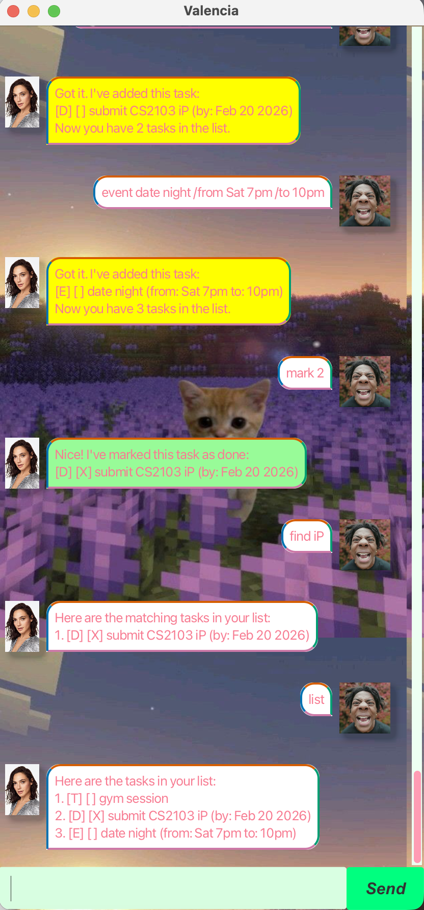

# Valencia User Guide

Valencia is a quirky task manager chatbot with a cute personality. You can add tasks, mark/unmark them, search, delete, and even ask for a pickup line.

## Quick Start
1. Download the latest JAR from your GitHub releases.
2. Run it using Java 17:
    - `java -jar valencia.jar`
3. Type commands into the chat box and press **Send**.

---

## Command Summary

| Feature | Command |
|---|---|
| Greeting | `hi` / `hello` / `hey` |
| Add ToDo | `todo <description>` |
| Add Deadline | `deadline <description> /by yyyy-MM-dd` |
| Add Event | `event <description> /from <start> /to <end>` |
| List tasks | `list` |
| Mark done | `mark <taskNumber>` |
| Unmark | `unmark <taskNumber>` |
| Delete | `delete <taskNumber>` |
| Find | `find <keyword>` |
| Remind upcoming | `remind` or `remind <days>` |
| Exit | `bye` |
| Pickup line (personality) | `pickup` / `pickupline` / `pickup-line` / any sentence containing “pickup line” |

Notes:
- `<taskNumber>` is **1-based** (first task is `1`, second is `2`, etc.).
- Commands are case-insensitive (e.g., `LIST` works the same as `list`).

---

## Greeting

Say hi to Valencia.

**Command:**
- `hi` / `hello` / `hey`

**Example:**
- `hi`

**Expected outcome:**
- Valencia replies with a greeting message.

---

## Adding a ToDo

Adds a task without any date/time.

**Command format:**
- `todo <description>`

**Constraints:**
- Description **cannot be empty**.

**Example:**
- `todo buy groceries`

**Expected outcome:**
- Valencia confirms the task was added and shows the updated task count.

---

## Adding a Deadline

Adds a task that must be done by a date.

**Command format:**
- `deadline <description> /by yyyy-MM-dd`

**Constraints:**
- Must contain ` /by `
- Date must be **valid** and in **yyyy-MM-dd** format.

**Example:**
- `deadline submit CS2103 iP /by 2026-02-20`

**Expected outcome:**
- Valencia confirms the deadline task was added.

---

## Adding an Event

Adds a task that has a start and end time.

**Command format:**
- `event <description> /from <start> /to <end>`

**Constraints:**
- Must contain both ` /from ` and ` /to `
- `<description>`, `<start>`, and `<end>` cannot be empty
- `<start>` and `<end>` are treated as text (e.g., `Sat 7pm`, `2026-02-21 19:00`, etc.)

**Example:**
- `event date night /from Sat 7pm /to 10pm`

**Expected outcome:**
- Valencia confirms the event was added.

---

## Listing Tasks

Shows all tasks currently stored.

**Command:**
- `list`

**Example:**
- `list`

**Expected outcome:**
- Valencia prints a numbered list of tasks.

---

## Marking a Task as Done

Marks a task as completed.

**Command format:**
- `mark <taskNumber>`

**Constraints:**
- `<taskNumber>` must be a valid integer
- `<taskNumber>` must be within the list range

**Example:**
- `mark 2`

**Expected outcome:**
- Valencia confirms the task has been marked as done.

---

## Unmarking a Task

Marks a task as not done yet.

**Command format:**
- `unmark <taskNumber>`

**Constraints:**
- Same as `mark`

**Example:**
- `unmark 2`

**Expected outcome:**
- Valencia confirms the task has been unmarked.

---

## Deleting a Task

Deletes a task from the list.

**Command format:**
- `delete <taskNumber>`

**Constraints:**
- `<taskNumber>` must be a valid integer
- `<taskNumber>` must be within the list range

**Example:**
- `delete 3`

**Expected outcome:**
- Valencia confirms the task removed and shows the updated task count.

---

## Finding Tasks

Searches tasks by keyword (matches task descriptions).

**Command format:**
- `find <keyword>`

**Constraints:**
- Keyword cannot be empty

**Example:**
- `find iP`

**Expected outcome:**
- Valencia lists all matching tasks.

---

## Remind Upcoming Tasks

Shows tasks due in the next N days.

**Command format:**
- `remind`
- `remind <days>`

**Constraints:**
- If `<days>` is provided, it must be a **positive integer**
- If no days is provided, Valencia defaults to **7 days**

**Examples:**
- `remind`
- `remind 3`

**Expected outcome:**
- Valencia prints upcoming tasks within the given period.

---

## Pickup Line Mode (Personality Feature)

Valencia can switch into a fun “pickup line” interaction.

**Trigger commands:**
- `pickup`
- `pickupline`
- `pickup-line`
- `pick up line`
- `pickup line`
- Any message containing **“pickup line”** (e.g., `can i ask you for a pickup line?`)

**Flow:**
1. Valencia asks you to send a pickup line.
2. Your next input is treated as the pickup line.

**Easter egg:**
- If you send an empty message instead of a pickup line, Valencia responds with an extra dramatic error message.

**Example:**
- `can i ask you for a pickup line?`
- `are you wifi? because i feel a connection`

**Expected outcome:**
- Valencia replies with a flattered message.

---

## Exiting

Closes the program.

**Command:**
- `bye`

**Example:**
- `bye`

**Expected outcome:**
- Valencia says goodbye.
